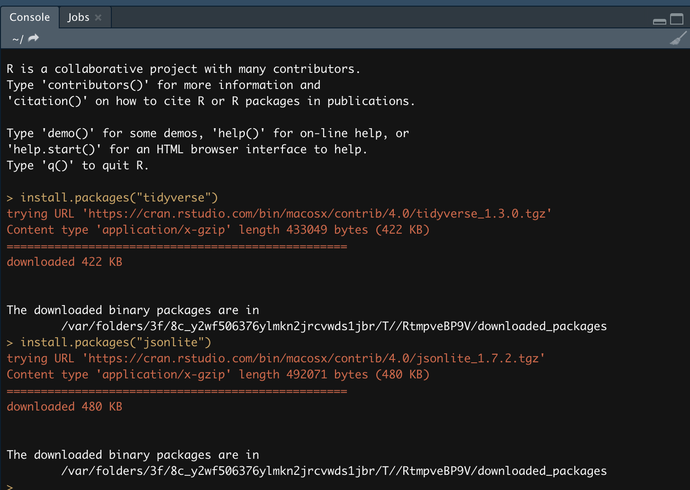
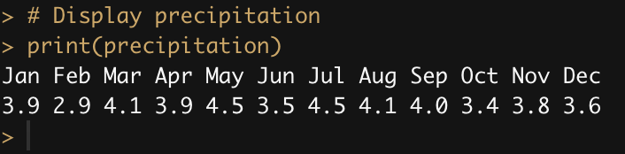
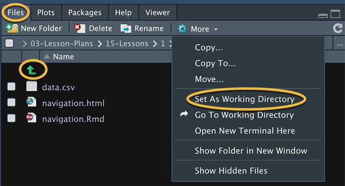
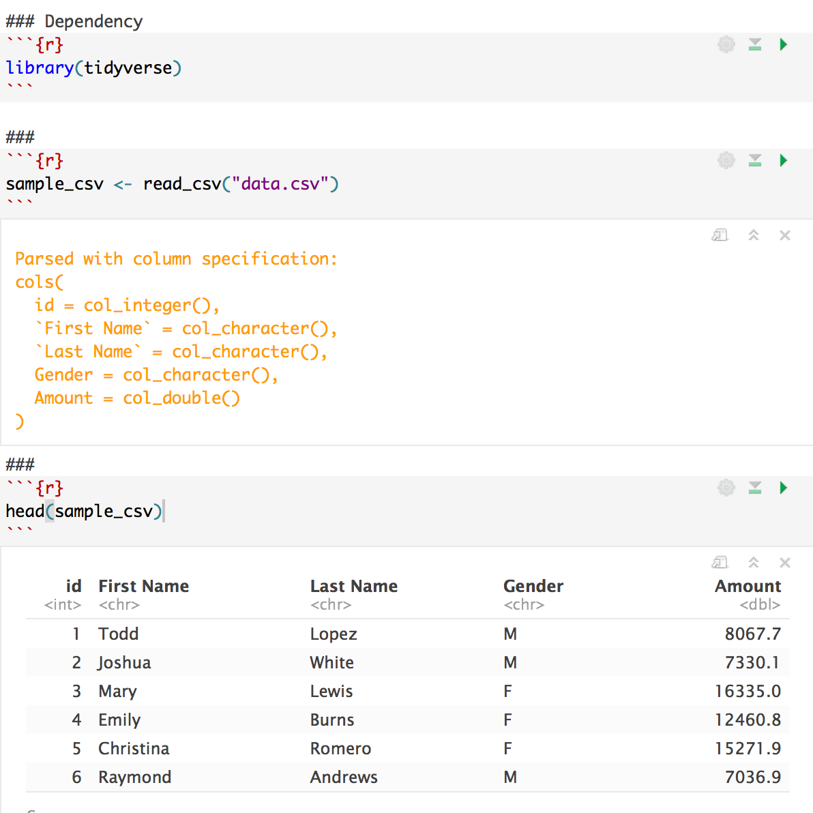
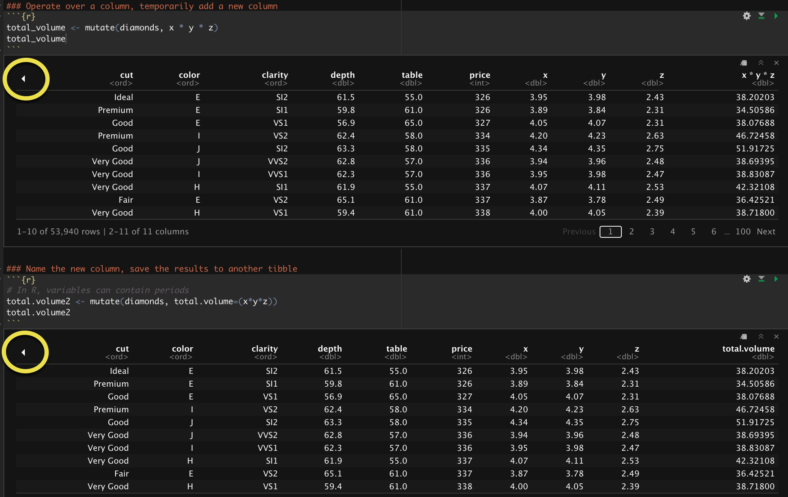

# Module 15 Class 1: The Fundamentals of R

## Overview

This week, we will be introducing the programming language R. In this unit, students will use R to perform data analysis, just like they did with Python and Pandas; additionally, they’ll use R to perform statistical analysis. 

In today's class, students will make sure R is installed correctly, then they'll review the basics of the R programming language, create vectors, use `for` loops, use `if-else` statements, identify substrings of strings, create functions, and organize data into tibbles &mdash; R’s version of data frames.

## Learning Objectives

By the end of class, students will be able to:

* Verify that R and RStudio are installed correctly
* Understand the fundamentals of R programming
* Understand how to use RStudio
* Learn how to create and manipulate data in tibbles
* Compare and contrast the features of Python and R

- - -

## Instructor Notes

* The activities in this class will complement Lessons **15.0.1: Using Statistics and R to Boost Your Data Science Repertoire** through **15.3.7: Add Layers to Plots**.  The students will benefit from these activities if they‘ve progressed through these lessons, which cover the following concepts, techniques, and tasks:  

* Understanding the basics of R programming
* Defining functions and using built-in functions
* Importing and reading files 
* Using indexing and slicing to filter data
* Using arithmetic, relational, and logical operators 
* Transforming, grouping, and reshaping data 
* Plotting data using `ggplot()`


## Instructor Prep

**What is the relevance of R?**

R is a programming language for statistical computing that is commonly used in data analysis and data mining. It’s also used for its strength in creating visualizations.

Students don’t need to walk away from this week with a mastery of R, but they will benefit from exposure to the core concepts of multiple languages and technologies throughout this course.


## Slides

[R + Statistics Day 1 slideshow](https://docs.google.com/presentation/d/1v8EE7RcrPHP3VI5N3X7GJ0oAMlyJHD1-7-jDCdaHyMg/edit?usp=sharing)

## Student Resources

If students were unable to download today's [activity resources](https://2u-data-curriculum-team.s3.amazonaws.com/data-viz-online-lesson-plans/15-Lessons/15-1-Student_Resources.zip) from Canvas, please share them with the students.

- - - 

## Before Class

### 0. Office Hours

| Activity Time: 0:30       |  Elapsed Time:     -0:30  |
|---------------------------|---------------------------|

<details>
  <summary><strong> 📣 0.1 Instructor Do: Office Hours</strong></summary>

* Before you begin class, hold office hours. Office hours should be driven by students. Encourage students to take full advantage of office hours by reminding them that this is their time to ask questions and get assistance from instructional staff as they learn new concepts.

* Expect that students may ask for the following: 

  * Further review on a particular subject
  * Debugging assistance
  * Help with computer issues
  * Guidance with a particular tool

</details>

- - - 

## During Class 

### 1. Getting Started

| Activity Time:       0:15 |  Elapsed Time:      0:15  |
|---------------------------|---------------------------|

<details>
  <summary><strong>📣 1.1 Instructor Do: Foundation Setting (0:10)</strong></summary>

* Welcome students to class.

* Direct students to post individual questions in the Zoom chat to be addressed by you or your TAs at the end of class.

* Open the slideshow and use slides 1 - 12 to walk through the foundation setting with your class. 

* **Big Picture:** This is an opportunity to zoom out and see the big picture of where they are in the program. Take a moment to mention some real-world examples that show the value of what they’re learning this week.

* **Program Pointers:** Talk through some of the key logistical things that will help students stay on track. This is an opportunity to speak to what students may need when they're at this particular point of the program. 

* **This Week - R:** Talk through the key skills students will be learning this week. The primary focus of the Day 1 activities is to reinforce the online content: the basics of R programming. On Day 2, the students will dive into statistics and apply what they’ve learned from Day 1 to perform statistical analysis. 

* **This Week's Challenge:** For this week's Challenge, let the students know that they'll use linear regression to predict vehicle MPG; they’ll create summary statistics on the pound-force per square inch of suspension coils across all manufacturing lots and in each lot; and they’ll perform t-tests to determine if all manufacturing lots, and each lot individually, are statistically different from the mean population.

* **Career Connection:** Let students know how they will use the skills covered this week throughout their careers. It's important for them to know the "why." Give examples of when they may be used in work or when you have used those skills in your workplace. 

  * Just a reminder that each week students receive a Career Connection in their course of work that ties to what academic content is being consumed. This Career Connection relates this week's material to a professional setting, encourages students to complete certain career services tasks, and provides technical interviewing questions, where applicable, that the student can work through.
 
  * Explore the [Career Engagement Network](https://careernetwork.2u.com/?utm_medium=Academics&utm_source=boot_camp) for more services and resources you’ll benefit from throughout your boot camp journey. 

* **How to Succeed This Week:** Remind your students that they may have moments of frustration this week as they learn something complex. These moments are great for deepening their knowledge. Use the slide material to outline some of the topics that they may find tricky in this module. Consider sharing something about your personal learning journey. It helps students to recognize that everyone starts somewhere and that they are not alone.

* **Today's Objectives:** Now, outline the concepts that will be covered in today's lesson. Remind students that they can find the relevant activity files in the “Getting Ready for Class” page in their course content.  

</details>

<details>
  <summary><strong>🎉  1.2 Everyone Do: Check-In (0:05)</strong></summary>

* Ask the class the following questions and call on students for answers:

    * **Q:** How are you feeling about your progress so far?

    * **A:** We are continuing to build your skillset by learning and using a new programming language. It’s okay to feel overwhelmed as long as you don’t give up.

    * **Q:** How comfortable do you feel with this topic? 

    * **A:** Let's do "fist to five" together. If you are not feeling confident, hold up a fist (0). If you feel very confident, hold up an open hand (5).

</details>

<sub>[Having issues with this activity? Report a bug!](https://bit.ly/2N4EGfu)</sub>

- - -

### 2. Introduction to R and Installation Check

| Activity Time:       0:10 |  Elapsed Time:      0:25  |
|---------------------------|---------------------------|

<details>
  <summary><strong>📣 2.1 Instructor Do: Introduction to R (0:05)</strong></summary>

* You can use slides 13 - 16 to assist you with this section.

* R is a language used for data analysis, statistics, and machine learning; it is also widely used in academia. 

* Whether Python or R is better is up for debate. R offers compelling features like piping and easy-to-use plotting; it also provides extensive benefits, including faster computation speed, specialized statistical packages, and great visualization libraries.

</details>

<details>
  <summary><strong>🎉 2.2 Everyone Do: Installation Check (0:05)</strong></summary>

* Complete a quick check to ensure all students have R and RStudio installed correctly. 

* Open up the terminal or GitBash and have students follow along.

  * Enter `R --version` to display the version of R that is installed.

    * Make sure that students have version 4.0.1 or later.

* Ensure that students can open RStudio.

* Next, check that the students have installed the `tidyverse` and `jsonlite` libraries or packages by using `install.packages("package-name")` in the RStudio console.


  


* Send out [this link to R keyboard shortcuts](https://support.rstudio.com/hc/en-us/articles/200711853-Keyboard-Shortcuts).

</details>

<sub>[Having issues with this activity? Report a bug!](https://bit.ly/3v3SSGB)</sub>

- - - 

### 3. We R in Junior High Again 

| Activity Time:       0:30 |  Elapsed Time:      0:55  |
|---------------------------|---------------------------|

<details>
  <summary><strong>📣 3.1 Instructor Do: Basics of R (0:10)</strong></summary>

* You can use slides 18 - 33 to assist you with this section.

* In this demonstration, you will cover the basic syntax of R, which bears resemblance to what we have seen in Python and JavaScript. Little of what is covered today should be completely unfamiliar.

* Open or consult [01_Ins_RBasics/Solved/01_Ins_R_Basics.html](Activities/01_Ins_RBasics/Solved/01_Ins_R_Basics.html) for the complete code, and review the following explanation: 

* In R, like Python, we can assign values to variables without specifying the data type. However, unlike Python, the left-pointing arrow `<-` is used in R to assign the value on the right to the variable on the left. Semantically, it is probably more accurate than the equals sign. The equals sign can and will be used in certain cases, as we will see. For simple assignment operations, however, the "assignment operator," `<-`, is preferred.

  ```R
  a <- 3
  b <- 3.1415
  c <- "This is a string"
  d <- "Yet another string"
  e <- TRUE
  f <- FALSE
  g <- T
  h <- F
  ```

  * Tip: the keyboard shortcut for the assignment operator is `Option-Hyphen` on Mac and `Alt-Hyphen` on PCs.

* Like Python lists, an R **vector** can hold multiple items; however, unlike Python lists, a vector must hold items of the same type:

  ```R
  disney_characters <- c("mickey", "minnie", "donald", "goofy")
  presidents <- c("washington", "adams", "jefferson")
  numbers_vector <- c(1, 3, 5, 7, 9, 11)
  ```

  * Even a single item can be a vector.

* **This point is extremely important**: R data structures are indexed at one, whereas Python and JavaScript arrays are indexed at zero. In this example, `presidents[1]` returns the first item from the vector, `"washington"`, whereas in Python or JavaScript, `"adams"` would be returned.

* As seen above, vectors are created using the `c()`, or concatenate, function. We can combine two vectors into a single vector with the same operation:

  ```R
  combined_vector <- c(disney_characters, presidents)
  ```

* A `for` loop in R is similar to what we’ve seen in Python and JavaScript:

  ```R
  for (x in combined_vector){
      print(x)
  }
  ```

* We can also create a vector of integers using the colon operator (`:`) and the `length` function. We can even perform operations on them en masse:

  ```R
  numeric_vector <- 1:length(combined_vector)
  squared_vector <- numeric_vector**2
  ```


* An `if` statement works much the same way in R as it does in Python:

  ```R
  for (prez in presidents){
      if (nchar(prez) > 5){
          next
      }
      else {
        print(prez)
      }
  }
  ```

  * `nchar()` returns the number of characters in a string. `next` stops the current loop iteration and starts a new iteration from the beginning.

* R vectors can contain only a single data type, but a list in R can contain multiple data types.

  ```R
  random_list <- list("movies"=c("Star Wars", "Titanic", "Avatar"),
  						  "states"=c("California", "Oklahoma", "Texas", "Virginia"),
  						  "coins"=c("penny", "dime", "nickel", "quarter"),
  						  "first_presidents"=presidents,
  						  "nums"=c(1,2,3,4,5),
  						  "bools"=c(T,F,T,T,T,F)
  						  )
  ```

  * We can use bracket notation to access an item in a list:

  ```R
  random_list["states"]
  ```

  * We can also use a dollar sign to accomplish the same task:

  ```R
  random_list$coins
  ```

* We can verify that `random_list` is indeed a list with `typeof()`:

  ```R
  typeof(random_list)
  ```

* Send out the [01_Ins_RBasics/Solved](Activities/01_Ins_RBasics/Solved/) folder for students to refer to later.

* Ask the class the following questions and call on students for the answers:

    * **Q:** Where have we used this before?

    * **A:** R basics were covered in Lesson 15.2.1.

    * **Q:** How does this activity equip us for the Challenge?

    * **A:** We will need to understand R basics to help us complete the Challenge.

    * **Q:** What can we do if we don't completely understand this?

    * **A:** We can refer to the lesson plan and reach out to the instructional team for help.

* Take a moment to address any questions before moving on to the student activity.


</details>

<details>
  <summary><strong>✏️ 3.2 Students Do: We R in Junior High Again (0:15)</strong></summary>

* You can use slides 34 - 35 to assist you with this section.

* In this activity, students will practice the basics of R syntax. They'll use R to create vectors,`for` loops, and `if-else` statements; to identify substrings of strings; and to create functions to generate daily attendance sheets and locker combinations. 

* Make sure the students can download and open the [instructions](Activities/02_Stu_RBasics/README.md) and [jr_high_starter.R](Activities/02_Stu_RBasics/Unsolved/jr_high_starter.R) file from the AWS link.

* Go over the instructions with the students and answer any questions before breaking the students out in groups. 

* Divide students into groups of 3-5. They should work on the solution by themselves, but they can talk to others in their group to get tips.

* Let students know that they may be asked to share and walk through their work at the end of the activity.


</details>

<details>
  <summary><strong>⭐ 3.3 Review: Basics of R (0:05)</strong></summary>

* Once time is up, ask for volunteers to walk through their solution. Remind them that it is perfectly alright if they didn't finish the activity. 

* To encourage participation, you can open the [jr_high_starter.R code](Activities/02_Stu_RBasics/Unsolved/jr_high_starter.R) and ask the students to help you complete each part.

* If there are no volunteers, open up the [jr_high.R solution](Activities/02_Stu_RBasics/Solved/jr_high.R) file and go over each part of the solution, answering whatever questions students may have.

* Key points to cover over the course of the discussion:

* In **Part I**, the `for` loop can be written as follows:

  ```R
  for (student in class){
    print(student)
  }  
  ```

  * Then, we call the `roll_call` function with the `students` vector. 


* In **Part II**, the `for` loop is similar to the `for` loop in **Part I**, but it also includes the vector to generate three random numbers from 0 through 33.

  ```R
  for (student in class){
    combination <- sample(33,3)
    print(student)
    print(combination)
  }  
  ```
   * Then, we call the `locker_combinations` function with the `students` vector. 

* In the `for` loop in **Part III**, we create a vector that holds the substring of the second letter in each student's name, `second_letter <- substr(student,2,2)`.

  * The first argument is the string. In this case, `student` stands for the name of each student in the `for` loop.

  * The second and third arguments denote the start and end points of the substring. To return only the second letter, we start and end our substring at the second letter. Using `substr(student, 2, 4)` would return a substring of three letters, from the second letter through the fourth.

  * The `if` statement will check if the `second_letter` is an "e", `(second_letter == 'e')`. If the statement is true, then we print the student's name and assign them a new three-number combination with each number between 33 and 66. 

    ```R
    if (second_letter == 'e'){
      print(student)
      combination <- sample(33:66,3)
      print(combination)
    }  
    ```

* Next, go over how to create an [R Markdown](https://rmarkdown.rstudio.com/index.html) file since it will be used in subsequent activities.

* Send out the [02_Stu_RBasics/Solved](Activities/02_Stu_RBasics/Solved) folder for students to refer to later.

* Answer any questions before proceeding to the next activity.

</details>

<sub>[Having issues with this activity? Report a bug!](https://bit.ly/2OuZmgW)</sub>

- - -

### 4. Vectors and Pipes & File Structure Navigation

| Activity Time:       0:25 |  Elapsed Time:      1:20  |
|---------------------------|---------------------------|

<details>
  <summary><strong>📣 4.1 Instructor Do: Vectors and Pipes (0:15)</strong></summary>

* You can use slides 36 - 42 to assist you with this section.

* In this activity, the students will review how to work with vectors and run statistical summaries. As you go over each block of code, encourage student participation.

* Make sure the students can download and open the [instructions](Activities/03_Ins_Vectors/README.md) and the [vectors_starter.R](Activities/03_Ins_Vectors/Unsolved/vectors_starter.R) files from the AWS link.

* Have everyone open the [vectors_starter.R](Activities/03_Ins_Vectors/Unsolved/vectors_starter.R) file. 

* Have the students create and print the `months` and `precipitation` vectors; then, review the [`dplyr` library](https://cran.r-project.org/web/packages/dplyr/vignettes/dplyr.html) and explain why we are using it. 

* Next, review how a vector in R can be paired up with another vector using the [names()](https://www.rdocumentation.org/packages/base/versions/3.5.1/topics/names) function.  

  ```R
  # Assign names to a vector
  # Assign months to precipitation as names
  names(precipitation) <- months

  # Display precipitation
  print(precipitation)
  ```
 
 * When we display `precipitation`, the output console returns each month and its average rainfall in a column. 

    

* Then, show the students how to access a single member of `precipitation`. Point out that this is similar to retrieving Series data from a single column in Pandas using `df['column']`. 

  ```R
  # Access a single member of precipitation by its name
  mar_precipitation <- precipitation["Mar"]
  print(mar_precipitation)
  ```

* Next, point out that the R [`summary()` function](https://www.rdocumentation.org/packages/base/versions/3.5.1/topics/summary) will show a statistical summary, just like the `describe()` function does for Pandas. 
  
  * We can store the results of `summary()` in a vector and access features of the summary.

    ```R
    # Display summary data of precipitation
    summary(precipitation)

    # Store the results in a vector. 
    precipitation_summary <- summary(precipitation)
    ```

  * We can also use the familiar square brackets to index elements in a vector.

    ```R
    # Access features of a summary
    precipitation_summary["Min."]
    precipitation_summary["Mean"]
    ```
  * Finally, show the students how you can access the value using double brackets. 

    ```R
    # Use double brackets to access only the value
    precipitation_summary[["Max."]]
    ```

* R also has the pipe operator (`%>%`), which is a nifty feature that can improve workflow. Demonstrate the following example:

  * The `summary(precipitation)` is used to obtain a summary of the `precipitation` vector.

  * The same result can be obtained by using the pipe operator: `precipitation %>% summary()`.

  * The pipe operator (`%>%`) takes what's on the **left** (the `precipitation` vector) and performs the operation on the **right** (the `summary()` function).

  * In mathematics, this is equivalent to `f(g(x))`, or `(f ◦ g)(x)`.

  * In computer science, this is equivalent to a Terminal command such as `ps -ax | grep <application name>`.

  * The keyboard shortcut for the pipe operator, `%>%`, is `Cmd` + `Shift` + `M` on Mac OS and `Ctrl` + `Shift` + `M` on Windows OS.

  * Although the usefulness of the pipe operator may not be immediately obvious, it becomes more apparent in a sequence of multiple operations.

* In addition to the `summary()` function, R ships with a [stats package](https://www.rdocumentation.org/packages/stats/versions/3.5.1). One of the features of the statistical package is the standard deviation function, [`sd()`](https://www.rdocumentation.org/packages/stats/versions/3.5.1/topics/sd). 

  ```R
  # Standard deviation
  # Display the standard deviation 
  sd(precipitation)
  ```

* We can also round a number. 

  ```R
  # Round SD to two digits
  stdev <- sd(precipitation)
  round(stdev, 2)
  ```

* Next, have the students use the pipe operator to determine the standard deviation and round a number.

* There are a few more handy methods to consider in R, including `length()` and `sum()`.

  ```R
  # A few more methods
  # Determine the length of a vector
  length(precipitation)

  # Display the sum of a vector
  yearly_precipitation <- sum(precipitation)
  yearly_precipitation
  ```

* Have the students use the pipe operator to determine the length and sum of the `precipitation` vector. 

* Send out the [03_Ins_Vectors/Solved](Activities/03_Ins_Vectors/Solved) folder for students to refer to later.

* Ask the class the following questions and call on students for the answers:

    * **Q:** Where have we used this before?

    * **A:** R basics were covered in Lessons 15.2.4 and 15.2.5.

    * **Q:** How does this activity equip us for the Challenge?

    * **A:** We will need to be familiar with vectors and the pipe operator to complete the Challenge.

    * **Q:** What can we do if we don't completely understand this?

    * **A:** We can refer to the lesson plan and reach out to the instructional team for help.

* Take a moment to address any questions before moving on to the student activity.

</details>

<details>
  <summary><strong>📣 4.2 Instructor Do: File-Structure Navigation (0:10)</strong></summary>

* You can use slides 43 and 44 to assist you with this section.

* In this demonstration, you will show students how to work with external data files, like CSVs. Students will need to familiarize themselves with navigating the file structure in R, which is similar to the structure used in Unix-based environments.

* In the RStudio console, the command to display the current directory is `getwd()`.

  * To accomplish the same task in Terminal or Git Bash, we would type `pwd`.

* To display the contents of the current directory, type `dir()` or `list.files()` in the RStudio console.

  * This is the equivalent of `ls` in Unix-flavored environments.

* To change the directory, enter `setwd()` and add the folder name inside the parentheses, e.g.,`setwd("Desktop")`. 

  * This is the equivalent of `cd` in Unix.

* A simpler way to set the working directory in RStudio is to select the `Files` panel, then use either the `up` arrow icons to move up a directory or click on a directory name to navigate into it. Then, when you are in the desired directory, you can set that directory to the working directory by selecting `Set As Working Directory` under the `More` menu (designated by the gear icon).

  

  * **Note:** You can (re)set the working directory as often as you like during a session. This way you don't need to provide the file path when you want to load a file located in another directory. 

* Next, navigate to the directory where this activity is located, set the directory as the working directory, and load the `data.csv` file:

  

* Inform students that to run a cell of code in an RMD file, they can click on the green play button or press `Ctrl+Shift+Enter` (`Cmd+Shift+Enter` in Mac).

* Here are some additional commands for students to reference, but they are not required to learn them:

  * To create a directory called "data_science", we would enter `dir.create("data_science")`.

  * To create a file: `file.create("my_first.R")`

  * To determine whether a file exists: `file.exists()`

  * Obtain additional info on a file: `file.info()`

  * Rename a file: `file.rename(file1, file2)`

  * To copy a file: `file.copy()`

* Send out the [Activities/04_Ins_Navigation/Solved](Activities/04_Ins_Navigation/Solved) folder for students to refer to later.

* Next, have the students load `data.csv` in RStudio. 

  * The `tidyverse` package is required for the `read_csv()` function. Technically, only the `readr` package, which comes with `tidyverse`, is required, but we use `tidyverse` here for convenience.

  * Have the students use `read_csv()` to read in the `data.csv` file. If students ask about the difference between `read_csv()` and `read.csv()`, inform them that `read_csv()` is more efficient and has become the de facto standard for reading CSV files in R.

* Make sure all the students were able to load and read in the `data.csv` file before moving on. 

* Ask the class the following questions and call on students for the answers:

    * **Q:** Where have we used this before?

    * **A:** Using the `tidyverse` package and loading/reading in CSV files were covered in Lesson 15.2.3. 

    * **Q:** How does this activity equip us for the Challenge?

    * **A:** We will need to load and read CSV files to complete the Challenge.

    * **Q:** What can we do if we don't completely understand this?

    * **A:** We can refer to the lesson plan and reach out to the instructional team for help.

* Take a moment to address any questions before moving on to the next activity.


</details>

<sub>[Having issues with this activity? Report a bug!](https://bit.ly/2PGZIl7)</sub>


- - - 

### 5. Back to School with R

| Activity Time:       0:35 |  Elapsed Time:      1:55  |
|---------------------------|---------------------------|

<details>
  <summary><strong>📣 5.1 Instructor Do: Data Frames in R (0:10)</strong></summary>

* You can use slides 45 - 52 to assist you with this section.

* In this demonstration, show the students how to import and read a dataset into R's version of a data frame, the `tibble` (a word play on "table"). Then, perform some exploratory analysis on the data frame. 

* Tibbles in R are similar to Pandas DataFrames: data are organized by rows and columns, which allow operations for computation and data-wrangling. However, there are some unique aspects of R, such as piping, that we will discuss later.

* The diamond dataset is available when the `ggplot2` package is loaded. Loading the `tidyverse` package will automatically load `ggplot2`.

* The `tibbles.html` file provides a complete walk-through of the code, but here are some additional details:

* The `library(tidyverse)`: `tidyverse` is a collection of data science-oriented packages.

  * Tibbles are not available in standard R, but they are enabled by `tidyverse` and are generally superior to R's standard dataframe.
  * The `library()` function loads this package.

  ```R
  ### Load dependency and sample data set
  library(tidyverse)
  data(diamonds, package='ggplot2')
  ```

  * The `data()` function takes the data source, `diamonds`, and the plotting package, `ggplot2`, as arguments.

* Run through the chunks to show the students how to do some basic exploratory analysis. Some of these functions were covered in **Lesson 15.2.4**. 

* **NOTE:** Be sure to take the time to emphasize that, unlike other languages that we have encountered, R allows the use of periods in regular variable names:

  ```R
  total.volume2 <- mutate(diamonds, total.volume=(x*y*z))
  ```

  * The variable, `total.volume2`, does not refer to a `volume2` property of the `total` object as it would in JavaScript. Instead, it is equivalent to `total_volume2`.

* With the `mutate()` function, we can add a new column to the tibble.

  

  * Note that, in the `Rmd` file, it may be necessary to click on the arrow to reveal more columns in a tibble.

* Send out the [Activities/05_Ins_Vectors/Solved](Activities/05_Ins_Tibble/Solved) folder for students to refer to later.

* Ask the class the following questions and call on students for the answers:

    * **Q:** Where have we used this before?

    * **A:** Many of the functions shown here were covered in Lessons 15.2.4 and 15.2.5.

    * **Q:** How does this activity equip us for the Challenge?

    * **A:** We will need to be familiar with using R functions to complete the Challenge.

    * **Q:** What can we do if we don't completely understand this?

    * **A:** We can refer to the lesson plan and reach out to the instructional team for help.

* Take a moment to address any questions before moving on to the student activity.

</details>

<details>
  <summary><strong>🎉 5.2 Everyone Do: Back to School (0:25)</strong></summary>

* In this activity, the students will use R to perform the PyCitySchool analysis from Module 4!

* Make sure the students can download and open the [instructions](Activities/06_Evr_Tibble/README.md), the [students.csv](Activities/06_Evr_Tibble/Resources/students.csv), and the [schools_starter.Rmd](Activities/06_Evr_Tibble/Unsolved/schools_starter.Rmd) files from the AWS link.

* Go over the instructions with the students and check for understanding.

* Have everyone open the [schools_starter.Rmd](Activities/06_Evr_Tibble/Unsolved/schools_starter.Rmd) file in RStudio and let them work on the solution for 10 minutes. 

* When time is up, ask for volunteers to help you perform each task. If there are no volunteers, use the solved [schools.Rmd](Activities/06_Evr_Tibble/Solved/schools.Rmd) file to go over the most salient aspects of this activity, including the following points:

  * First, we load `tidyverse` with `library(tidyverse)`; then, we use `read_csv()` to load an external CSV file.

  * The `head()` and `tail()` functions can be used to preview the tibble.

  * The `unique()` function is used to display the unique entries in a column; then, the `length()` function can be used to get the number of schools. 

  * To print the results to the RStudio console, we can use the `paste()` function, which is similar to the `print()` function in Python.

    ```R
    unique(students$school_name)
    school_count <- unique(students$school_name)
    length(school_count)
    paste("There are", length(school_count), "schools")
    ``` 

  * Using the `nrow()` function on the `students` variable returns the number of students in the school.

  * We can get the average reading and math scores by using the `summarize()` function and passing in the `students` variable, and then specifically calling the `mean()` method on the `reading_score` and `math_score` columns.

    ```R
    mean_reading_score <- summarize(students, mean(reading_score))
    paste("The average reading score is", mean_reading_score)

    mean_math_score <- summarize(students, mean(math_score))
    paste("The average math score is", mean_math_score)
    ``` 

  * The `filter()` function is used to filter the data based on a condition. It will find rows where the conditions `reading_score >= 70` and `math_score >= 70` are true. With some data munging, we can print out the percentage of students passing reading and the percentage of students passing math.

     ```R
    passing_reading <- filter(students, reading_score >= 70)
    passing_reading_count <- nrow(passing_reading)
    percentage_passing_reading <- passing_reading_count*100 / student_count
    percentage_passing_reading <- round(percentage_passing_reading,2)

    paste(percentage_passing_reading, "% of the students have passing reading scores.")

    passing_math <- filter(students, math_score >= 70)
    passing_math_count <- nrow(passing_math)
    percentage_passing_math <- passing_math_count*100 / student_count
    percentage_passing_math <- round(percentage_passing_math, 2)

    paste(percentage_passing_math, "% of the students have passing math scores.")
    ```

  * The same filtering can be used to get the percentage of students who are passing both reading and math. 

* If time permits, show the students how they can use the `group_by()` function to perform aggregate calculations, such as mean and sum.

  ```R
  ### Calculate the average math and reading scores by school
  school_grouping <- group_by(students, school_name)
  summarize(school_grouping, avg.reading=mean(reading_score), avg.math = mean(math_score))

  ### Calculate the average math and reading scores by grade level at each school
  grade_grouping <- group_by(students, school_name, grade)
  summarize(grade_grouping, avg.reading=mean(reading_score), avg.math=mean(math_score))
  ```

* Send out the [06_Evr_Tibble/Solved](Activities/06_Evr_Tibble/Solved) folder for students to refer to later.

* Answer any questions before ending class.


</details>

<sub>[Having issues with this activity? Report a bug!](https://bit.ly/3che7w7)</sub>


### 6. Ending Class 

| Activity Time:       0:05 |  Elapsed Time:      2:00  |
|---------------------------|---------------------------|

<details>
  <summary><strong>📣  6.1 Instructor Do: Review </strong></summary>

* Before ending class, review the skills that were covered today and mention where in the module these skills are used: 
  * Installing R and RStudio was covered in **Lesson 15.1.2** and **Lesson 15.1.3**.
  * The fundamentals of R programming were covered in **Lesson 15.2.1**.
  * Using the `tidyverse` package, and loading and reading in CSV files were covered in **Lesson 15.2.3**.
  * Manipulating datasets and using functions were covered in **Lesson 15.2.4** and **Lesson 15.2.5**.


* Answer any questions the students may have.

</details>

<sub>[Having issues with this section? Report a bug!](https://bit.ly/38lYVN2)</sub>

---

© 2021 Trilogy Education Services, LLC, a 2U, Inc. brand.  Confidential and Proprietary.  All Rights Reserved.