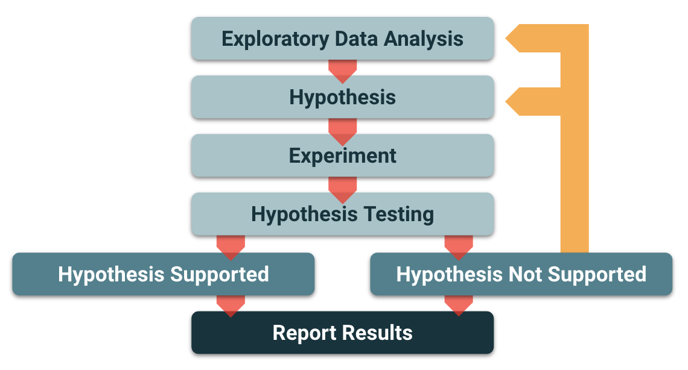
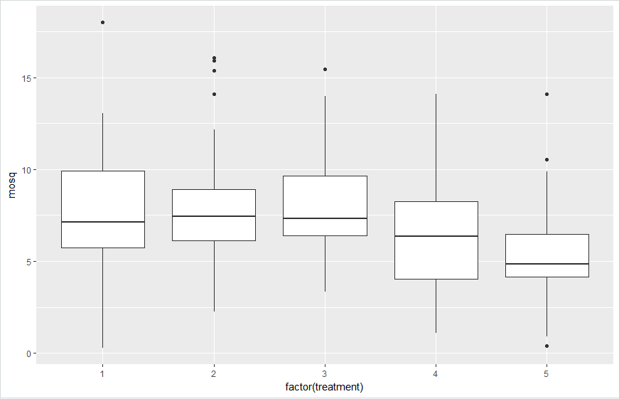
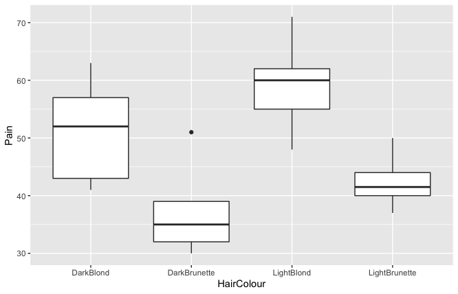
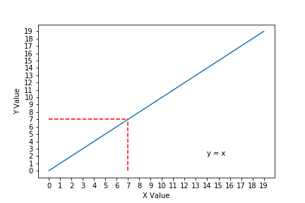
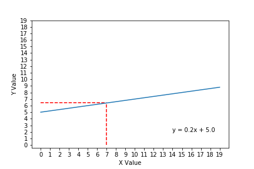
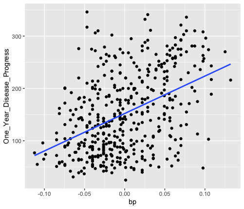

# Module 15 Class 2: Statistical Analysis Using R

## Overview

Before class, walk through this week's Challenge assignment in office hours; then, in class, the students will use R to perform hypothesis testing, one-sample and two-sample t-tests, ANOVA, linear regression and multiple linear regression, and A/B testing. 

## Learning Objectives

By the end of class, students will be able to:

* Use one-sample and two-sample t-tests 
* Use ANOVA 
* Perform linear and multiple linear regression

- - -

## Instructor Notes

The activities in this class will complement Lessons **15.4.1: Identifying Statistical Test Types** through **15.10.1: Whose Analysis Is It Anyway?**. The students will benefit from these activities if they‘ve progressed through these lessons, which cover the following concepts, techniques, and tasks:  

* Testing for qualitative and quantitative normality
* Understanding skewed distributions
* Understanding and applying the null and alternative hypotheses
* Generating a sample dataset using random sampling
* Applying one-sample and two-sample t-tests
* Applying ANOVA to compare means across two or more groups
* Understanding and determining the Pearson correlation coefficient 
* Applying linear and multiple linear regression 
* Applying chi-square for categorical data
* Understanding A/B testing


## Slides

[R + Statistics Day 2 slideshow](https://docs.google.com/presentation/d/13ramUC_7klyH7FfmkbzdhBZydCBUrQJTVwwt-LtvZEw/edit?usp=sharing)


## Student Resources

If students were unable to download today's [activity resources](https://2u-data-curriculum-team.s3.amazonaws.com/data-viz-online-lesson-plans/15-Lessons/15-2-Student_Resources.zip) from Canvas, please share them with the students.

- - - 

## Before Class

### 0. Office Hours

| Activity Time: 0:30       |  Elapsed Time:     -0:30  |
|---------------------------|---------------------------|

<details>
  <summary><strong>📣 Instructor Do: Challenge Instruction Walkthrough</strong></summary>

Let the students know that the first few minutes of Office Hours will include a walkthrough of the Challenge requirements and rubric, as well as helpful tips they need in order to be successful.

Open the Challenge in Canvas and go through the high-level instructions and requirements with your class. Be sure to check for understanding.

Open the Rubric in Canvas and go through the Mastery column with your class, and show how it maps back to the requirements for each deliverable. Be sure to check for understanding.

Let them know that this challenge has **four deliverables**. All analysis deliverables will have a written portion, and the final deliverable will be an entirely written assignment where they'll design their own statistical study. 

The first deliverable, **Deliverable 1: Linear Regression to Predict MPG**, requires them to perform linear regression to predict the mpg of MechaCar prototypes using variables within the `MechaCar_mpg.csv` file; then, they will provide a summary of the results.

To complete this deliverable, they'll need to read in the `MechaCar_mpg.csv` file as a data frame and then perform linear regression using the `lm()` function with the variables they want to use. Then, using the `summary()` function, they'll calculate the p-value and R squared value for the linear regression model. 

For the second deliverable, **Deliverable 2: Summary Statistics on Suspension Coils**, they'll create a summary statistics table that has the mean, median, variance, and standard deviation for the pound-force per square inch (PSI) of suspension coils across all manufacturing lots and for each lot individually. Then, they will summarize their interpretation of the results.
 

To complete this deliverable, they'll need to add the `Suspension_Coil.csv` file as a data frame and then use the `summarize()` function to get the mean, median, variance, and standard deviation on the PSI column. 

Next, they'll need to calculate the total summary statistics on the PSI column for each Manufacturing lot. First, they'll need to use the `group_by()` function to create a table with each lot; then, they’ll use the `summarize()` function to get the mean, median, variance, and standard deviation of the suspension coil’s PSI as the columns for each lot. 

For the third deliverable, **Deliverable 3: T-Tests on Suspension Coils**, the learners will perform a t-test to determine if all manufacturing lots, and each lot individually, are statistically different from the mean population results of 1,500 pounds per square inch. Then, they will summarize their interpretation of the results.

For the first part, the learners will need to write a t-test using the `t.test()` function to determine if the PSI for all manufacturing lots is statistically different from the mean population of 1,500 pounds per square inch. 

Next, they'll need to perform separate t-tests on each of the three manufacturing lots, or the "subsets" of the data. For this part of the deliverable, we have provided a **Hint** for the students to help them determine how to write their RScript. 

For the final deliverable, **Deliverable 4: Design a Study Comparing the MechaCar to the Competition**, the learners will use their knowledge of R to design a statistical study that compares MechaCar vehicle performance against other manufacturers. 

For this part of the challenge, the learners will need to write up a short description of a statistical study that can quantify if the MechaCar outperforms the competition. In the study design, they will need to think critically about what metrics would be of interest to a consumer. We have provided some examples, like cost, city, highway fuel efficiency, horse power, maintenance cost, and safety rating. 

Encourage your class to begin the Challenge as soon as possible, if they haven’t already, and to use the Learning Assistants channel and the remainder of Office Hours with their instructional team for help as they progress through their work. If they feel like they need context to understand documentation or instructions throughout the week, this is where they can get it.

Open the floor to discussion and be sure to answer any questions they may have about the Challenge requirements before moving on to other areas of interest.

</details>

<details>
  <summary><strong>📣  Instructor Do: Office Hours</strong></summary>

For the remaining time, remind the students that this is their time to ask questions and get assistance from their instructional staff as they’re learning new concepts and working on the Challenge assignment.

Expect that students may ask for assistance. For example: 

* Challenge assignment 
* Further review on a particular subject
* Debugging assistance
* Help with computer issues
* Guidance with a particular tool

</details>


- - - 

## During Class 

### 1. Getting Started

| Activity Time:       0:10 |  Elapsed Time:      0:10  |
|---------------------------|---------------------------|

<details>
  <summary><strong>📣 1.1 Instructor Do: Foundation Setting (0:05)</strong></summary>

* Welcome students to class.

* Direct students to post individual questions in the Zoom chat to be addressed by you and your TAs at the end of class.

* Open the slideshow and use slides 1 - 7 to walk through the foundation setting with your class.

* **This Week - R and statistics:** Talk through the key skills that students will learn this week, and let them know that they are building on their knowledge and use of statistical analysis.

* **Today's Objectives:** Now, outline the concepts covered in today's lesson. Remind students that they can find the relevant activity files in the “Getting Ready for Class” page in their course content. 

</details>

<details>
  <summary><strong>🎉 1.2 Everyone Do: Check-In (0:05)</strong></summary>

* Ask the class the following questions and call on students for the answers:

    * **Q:** How are you feeling about your progress so far?

    * **A:** We are building on our statistical analysis skill set. Although we are using R, deepening our understanding of statistics will be broadly beneficial for us.  It's important to look back and see what we’ve accomplished, and acknowledge that it's a lot! It’s also okay to feel overwhelmed as long as you don’t give up. The more you practice, the more comfortable you'll be coding.
    
    * **Q:** How comfortable do you feel with this topic? 

    * **A:** Let's do "fist to five" together. If you are not feeling confident, hold up a fist (0). If you feel very confident, hold up an open hand (5).

</details>

<sub>[Having issues with this section? Report a bug!](https://bit.ly/30paY7U)</sub>

- - -

### 2. Intro to Hypothesis Testing and Forming Null and Alternative Hypotheses

| Activity Time:       0:30 |  Elapsed Time:      0:40  |
|---------------------------|---------------------------|


<details>
  <summary><strong> 📣 2.1 Instructor Do: Hypothesis Testing (0:10)</strong></summary>

* You can use slides 8 - 27 to assist you with this section.

* In the previous material, students learned all about summary statistics and regression. Even though students may know how to implement a linear regression in Python, they may not be aware of linear regression's other primary use; a statistical test!

* In data science, we are constantly manipulating, visualizing, and summarizing data, regardless of whether our dataset is newly collected or curated from years of data collection.

* The act of manipulating, visualizing, and summarizing data is known as **exploratory data analysis**, or **EDA**. EDA is an essential step in the **scientific method**, which is used to draw formal conclusions about data. 

  

* Up to this point in the course, we have been learning how to prepare data and perform exploratory data analysis to identify trends and make qualitative observations.

* The next step in the scientific method is building a **hypothesis** based on our exploratory data analysis and research. A **hypothesis** is a proposed solution or generalization for a scientific question that we may ask about our data.

* Ask the students to give you examples of questions they could ask, then provide the following examples:

  * **Q:** Does this new medication help patients recover faster compared to a placebo group? 
  
    * **Hypothesis:** If we give patients a dose of our new drug, they should recover at least 50% faster than those patients who do not receive the drug.

  * **Question:** Is the cost of living higher in my city compared to other cities? 
  
    * **Hypothesis:** If we collect different metrics around cost of living and total them together, then, on average, the total cost of living in my city should be significantly greater than that of our neighboring city.

  * **Question:** Can we predict a movie's IMDB score based on the length of the movie? 
  
    * **Hypothesis:** There is a linear relationship between the length of the movie and the IMDB score; therefore, the slope of the line should be nonzero. 

* Hypotheses should be as specific as possible to address a proposed question &mdash; the more specific the hypothesis, the easier it is to analyze. However, if a hypothesis is too specific, it may not yield meaningful results or generalize well. 

* Once we have formulated our hypothesis to answer a scientific question, we must break the hypothesis into two exhaustive and mutually exclusive hypotheses &mdash; our **null and alternative hypotheses**.

  * The **null hypothesis** states that observations or effects in a dataset are random and occur simply by chance.

  * The **alternative hypothesis** states that the observations or effects in a dataset are not random and are influenced by some external force. 

* Notice how these two hypotheses account for any and all possible outcomes &mdash; that's what makes them exhaustive and mutually exclusive. 

* By breaking down our hypothesis into the null and alternative hypotheses, we can use one of the two hypotheses to describe what was observed in our data and, therefore, provide the most accurate prediction for future observations and data. 

* The goal of hypothesis testing is to reject the **null hypothesis** through statistical tests. Rejecting the **null hypothesis** means that the hypothesis was true.

  * A hypothesis is a measurable and testable statement about something that you expect will happen.

  * The hypothesis is often expressed as an **If**/**Then** statement.

    * "If San Diego, CA, is warmer than Austin, TX, in July, then the average daily temperature will be higher."

  * The null hypothesis typically states that **NO** differences exist between the variables or groups of interest.

    * "If San Diego, CA, is not warmer than Austin, TX, in July, then there will be no difference in the average daily temperatures."

  * Rejecting the Null Hypothesis is never absolute. Instead, statisticians calculate the probability of observing the event. This is called the `p-value`. The p-value is then compared to a fixed significance level to determine if the null hypothesis can be rejected. A smaller p-value indicates stronger evidence against the null hypothesis.

* Explain the following steps for hypothesis testing:

  1. Determine the hypothesis and null hypothesis.

  2. Identify the appropriate statistical test.

  3. Determine the acceptable significance value.

  4. Compute the p-value.

  5. Determine if the p-value rejects the null hypothesis by comparing it to the significance value, which is typically < 0.05.

* Ask the class the following questions and call on students for the answers:

    * **Q:** Where have we used this before?

    * **A:** Hypothesis testing was covered in Lessons 15.5.1 and 15.5.2.

    * **Q:** How does this activity equip us for the Challenge?

    * **A:** We will need to create and test a hypothesis to complete the Challenge.

    * **Q:** What can we do if we don't completely understand this?

    * **A:** We can refer to the lesson plan and reach out to the instructional team for help.

* Ask students for any remaining questions before moving on to the student activity. 

</details>

<details>
  <summary><strong>👥 2.2 Partners Do: Forming Null and Alternative Hypotheses (0:15)</strong></summary>

* You can use slides 28 and 29 to assist you with this section.

* In this activity, students will work with a partner to create hypothesis statements to some example questions we could ask in a scientific study or in an analysis industry job.

* Make sure the students can download and open the [instructions](Activities/01-Par_Null_Hypothesis/README.md) from the AWS link.

* Go over the instructions in the README and answer any questions before breaking the students out in pairs. 

* Let students know that their group may be asked to share their null and alternative hypotheses.


</details>

<details>
  <summary><strong>⭐ 2.3 Review: Forming Null and Alternative Hypotheses (0:05)</strong></summary> 

* You can use slides 30 - 32 to assist you with this section.

* Open the solved [Null_Hypothesis.md](Activities/01-Par_Null_Hypothesis/Solved/Null_Hypothesis.md) file.

* Call on random partners to share their answers.

* As they share, guide them to answers like the following:

  * **Does dark chocolate positively affect arterial function in healthy individuals?** 

    * Hypothesis: If dark chocolate is related to arterial function in healthy individuals, then consuming 30 g of dark chocolate per day for 1 year will result in improved arterial function.

    * Null hypothesis: If dark chocolate is not related to arterial function in healthy individuals, then consuming 30 g per day of dark chocolate for 1 year will result in no improvement in arterial function.

    * Alternative hypothesis: If dark chocolate is related to arterial function in healthy individuals, then consuming 30 g of dark chocolate per day for 1 year will result in improvement in arterial function.

  * **Does coffee have anti-aging properties?**

    * Hypothesis: If coffee consumption is related to anti-aging, then consuming 400 mg of coffee daily will reduce mortality from age-related disease such as heart disease.

    * Null hypothesis: If coffee consumption is not related to anti-aging, then consuming 400 mg of coffee daily will not result in a reduction in age-related disease such as heart disease.

    * Alternative hypothesis: If coffee consumption is related to anti-aging, then consuming 400 mg of coffee daily will result in a reduction in age-related disease such as heart disease.

  * **Is biodiesel better for the environment than fossil fuel?**

    * Hypothesis: If we assume that carbon emission is the largest contributing factor to environmental damage from burning fuel, then biodiesel should produce significantly less carbon than fossil fuel.

    * Null hypothesis: If we burn one gallon of both fuels, fossil fuel will produce the same or less carbon than biodiesel.

    * Alternative hypothesis: If we burn one gallon of both fuels, fossil fuel will produce more carbon than biodiesel.

* Take a moment to address any questions before moving on to the next activity.


</details>

<sub>[Having issues with this section? Report a bug!](https://bit.ly/3bpYwer)</sub>


### 3. T-Tests

| Activity Time:       0:30 |  Elapsed Time:      1:10  |
|---------------------------|---------------------------|

<details>
  <summary><strong> 📣 3.1 Instructor Do: T-Test (0:10)</strong></summary>

* You can use slides 33 - 42 to assist you with this section.

* In this demonstration, you will review t-tests and perform t-tests on some data. 

* A common question in statistics is whether or not one group is significantly different from another group.

* The set of entities under study is referred to as the `population`, while a subset of the population is referred to as a `sample`.

* A t-test can be used to compare the mean of a sample to the population (one-sample t-test) or the difference between population means (two-sample t-test).

* The null hypothesis assumes that there is no meaningful difference between the two means. Therefore, the goal of the t-test is to reject the null hypothesis.

* Explain the use of p-values to determine significance with the following:

  * The p-value is the probability of seeing a meaningful difference between the two means by random chance, assuming that the null hypothesis cannot be rejected. 

  * For example, say that an acne medication, ActinoX, is undergoing a trial to see whether it eliminates acne more quickly than an older medication, Renovagene. The trial data indicates that ActinoX is effective, with a p-value of 0.0354. This means that there is a 96.46% chance that using ActinoX leads to a meaningful difference in the outcome compared to Renovagene; it also means there is a 3.54% chance that the improvements observed in the trial can be attributed to random chance.

  * If the level of significance was set at 0.05, the p-value of 0.0354 is low enough to reject the null hypothesis.

* Take a moment to discuss the implications of the p-value. 

  * The 0.05 cutoff for the significance isn't written in stone; it is arbitrarily chosen. Another value could have been chosen beforehand to determine the level of significance required to reject the null hypothesis.

  * However, setting a strict cutoff point in this way is not always ideal. It is helpful to think of the p-value as a means to manage scientific uncertainty.

* Open the R script, [02-Ins_TTest/Solved/Ins_1samp_ttest.R](Activities/02-Ins_TTest/Solved/Ins_1samp_ttest.R), and highlight the following:

  * The helper code is simply to generate some test data to work with and show its distribution.

  * One-sample t-tests are used to compare the sample mean to the population mean.

  * The `t.test()` function will accept an array of samples and a population mean `mu`, and compare the sample mean to the population mean.

  * The p-value in the first example is not statistically significant if we assume a significance of `p-value < 0.05`.

    ```R
    # T-Test Output:
    t = 0.67172, df = 199, p-value = 0.5025
    ```

  * The second dataset has a larger difference in means, which results in a statistically significant p-value.

    ```R
    # T-Test Output:
    t = 27.187, df = 199, p-value < 2.2e-16
    ```

* Explain that we can also use a two-sample t-test to compare two population means.

* Open the R script, [02-Ins_TTest/Solved/Ins_independent_ttest.R](Activities/02-Ins_TTest/Solved/Ins_independent_ttest.R) and highlight the following:

  * The two-sample t-test can be used to compare the means of two populations.

  * The two groups (populations) should be independent from one another (i.e., a test subject in one group could not be in the second group).

  * The underlying assumptions for this test are independence, normality, and homogeneity.

  * The `t.test()` function is again used to perform the calculations. Type `?t.test` in the console to bring up the R documentation on `t.test()`

  * Note that because `equal.var` has a default value of `FALSE`, `t.test()` will perform a Welch's t-test, which does not assume equal population variance (homogeneity). 

  * The p-value of 0.6447 in the first example is not statistically significant assuming a `p-value < 0.05`. However, the second dataset has a larger difference in means that does reject the null hypothesis (`p-value < 0.05`).

* Send out the the [02-Ins_TTest/Solved](Activities/02-Ins_TTest/Solved) folder for students to refer to later.

* Ask the class the following questions and call on students for the answers:

    * **Q:** Where have we used this before?

    * **A:** One-sample t-tests and two-sample t-tests were covered in Lesson 15.6.2 and 15.6.3, respectively.

    * **Q:** How does this activity equip us for the Challenge?

    * **A:** We will need to be familiar performing statistical analysis to complete the Challenge.

    * **Q:** What can we do if we don't completely understand this?

    * **A:** We can refer to the lesson plan and reach out to the instructional team for help.

* Ask students for any remaining questions before moving on to the student activity. 

</details>

<details>
  <summary><strong> ✏️ 3.2 Students Do: T-Test (0:15)</strong></summary>

* You can use slides 43 and 44 to assist you with this section.

* In this activity, the students will determine if there is a statistically significant difference in the number of vertebrae of Adult Sardines in Alaska vs. San Diego.

* Make sure the students can download and open the [instructions](Activities/03-Stu_Sardines/README.md), the [sardines.csv](Activities/03-Stu_Sardines/Resources/sardines.csv), the [description of the data](Activities/03-Stu_Sardines/Resources/description.md), and the [sardines_starter.R](Activities/03-Stu_Sardines/Unsolved/sardines_starter.R) files from the AWS link.

* Go over the instructions with the students and answer any questions before breaking the students out in groups. 

* Divide students into groups of 3-5. They should work on the solution by themselves, but they can talk to others in their group to get tips.

* Let students know that they may be asked to share and walk through their work at the end of the activity.

</details>

<details>
  <summary><strong> ⭐  3.3. Review: T-Test (0:05)</strong></summary>

* Once time is up, ask students whether the solution required a one-sample or two-sample (independent) t-test.

* Explain that we are comparing two independent populations, so an independent (two-sample) t-test is required.

* To encourage participation, you can open the [sardines_starter.R](Activities/03-Stu_Sardines/Unsolved/sardines_starter.R) and ask the students to help you complete each task.

* If there are no volunteers, open up the [sardines.R solution](Activities/03-Stu_Sardines/Solved/sardines.R) file and highlight the following:

  * First, we assign the sardine vertebrae metadata from Alaska and San Diego to separate variables. For each variable, use the `subset()` function and pass in the dataset, `sardines`, and the column, `location`, where Alaska is `location == 1` and San Diego is `location == 6`.

    ```R
    # Calculate the population mean for Sardine Vertebrae in Alaska.
    # Hint: use the subset() function to get only the data for Alaska.
    population1 = subset(sardines, location == 1)
    mean(population1[['vertebrae']])

    # Calculate the population mean for Sardine Vertebrae in San Diego.
    # Hint: use the subset() function to get only the data for San Diego.
    population2 = subset(sardines, location == 6)
    mean(population2[['vertebrae']])
  ```

  * Then, we determine the means for our populations, which appear to be very similar.

  * The `p-value` of 0.6072 does not reject the null hypothesis. 

* Send out the the [sardines.R solution](Activities/03-Stu_Sardines/Solved/sardines.R) file for students to refer to later.

* Ask for any remaining questions before moving on to the next activity.

</details>

<sub>[Having issues with this section? Report a bug!](https://bit.ly/3v4KrLh)</sub>


- - -

### 4. ANOVA

| Activity Time:       0:30 |  Elapsed Time:      1:40  |
|---------------------------|---------------------------|

<details>
  <summary><strong> 📣 4.1 Instructor Do: ANOVA (0:10)</strong></summary>

* You can use slides 45 - 52 to assist you with this section.

* Explain that a t-test is not the best statistical test to use when we want to compare the means of more than two groups. 

* **Q:** What test would we use to determine if **any** location was significantly different from other locations? 

* **A:** We would use analysis of variance, or ANOVA, to compare the means of more than one population.

* Highlight the following points about the ANOVA test:

  * ANOVA is a test to compare the means of multiple groups.

  * ANOVA assumes the null hypothesis that there is no difference between groups.

  * Any mean that is significantly different from the rest will result in a low p-value.

* Send out the link to the following [research paper](https://www.ncbi.nlm.nih.gov/pmc/articles/PMC4925378/) and explain the following:

  * This paper compares 5 treatments to reduce mosquito-human contact.

  * ANOVA is applied to compare all 5 treatments for statistical significance.

  * ANOVA only implies a statistically significant difference between the group means, but further analysis has to be completed between the groups.

Open the R script, [04-Ins_ANOVA/Solved/mosquito_anova.R](Activities/04-Ins_ANOVA/Solved/mosquito_anova.R), plot the data, and explain the following:

  * The boxplots of each treatment indicate a difference in at least one of the treatments.

    

  * The `aov` function is used to test the null hypothesis that two or more groups have the same population mean.

    * We have to provide the `aov()` function with two arguments, a formula, `y ~ x`, and a dataset. 

      ```R
      aov(y ~ x, data = dataset)
      ```

  * In the following code snippet that was used to create the boxplots, `ggplot(mosquito,aes(x=factor(treatment),y=mosq)) + geom_boxplot()`, the y value is `y=mosq` and the x value is `x=factor(treatment)`. These two values are used in the `aov()` function, and the dataset is `mosquito`. 

  * To obtain the p-value, we wrap the `aov()` function in the `summary()` function.

    ```R
    summary(aov(mosq ~ factor(treatment), data=mosquito))
    ```

  * After running this line of code, the p-value is `0.00192`, which matches the reported p-value from the original paper.

* Remind students that ANOVA only indicates that the group means are different, but additional testing is required to compare specific groups.

* Point out that there are important assumptions that must be satisfied before the p-value can be considered valid:

  1. The samples are independent.
  2. Each sample is from a normally distributed population.
  3. The population standard deviations of the groups are all equal.

* Send out the the [solved mosquito_anova.R](Activities/04-Ins_ANOVA/Solved/mosquito_anova.R) file for students to refer to later.

* Ask the class the following questions and call on students for the answers:

    * **Q:** Where have we used this before?

    * **A:** ANOVA was covered in Lesson 15.6.5.

    * **Q:** How does this activity equip us for the Challenge?

    * **A:** We may need to use ANOVA to complete the Challenge.

    * **Q:** What can we do if we don't completely understand this?

    * **A:** We can refer to the lesson plan and reach out to the instructional team for help.

* Ask students for any remaining questions before moving on to the student activity. 

</details>

<details>
  <summary><strong> ✏️ 4.2 Students Do: ANOVA (0:15)</strong></summary>

* You can use slides 53 and 54 to assist you with this section.

* In this activity, the students will use ANOVA to compare the differences in pain threshold for people with different hair colors.

* Make sure the students can download and open the [instructions](Activities/05-Stu_ANOVA/README.md), the [hair.csv](Activities/05-Stu_ANOVA/Resources/hair.csv), the [description of the data](Activities/05-Stu_ANOVA/Resources/description.md), and the [hair_anova_starter.R](Activities/05-Stu_ANOVA/Unsolved/hair_anova.R) files from the AWS link.

* Go over the instructions with the students and answer any questions before breaking the students out in groups. 

* Divide students into groups of 3-5. They should work on the solution by themselves, but they can talk to others in their group to get tips.

* Let students know that they may be asked to share and walk through their work at the end of the activity.

</details>

<details>
  <summary><strong> ⭐ 4.3 Review: ANOVA (0:05)</strong></summary>

* Once time is up, ask for volunteers to walk through their solution. Remind them that it is perfectly alright if they didn't finish the activity. 

* To encourage participation, you can open the [hair_anova_starter.R](Activities/05-Stu_ANOVA/Unsolved/hair_anova.R) and ask the students to help you complete each part.

* If there are no volunteers, open up the [hair_anova.R](Activities/05-Stu_ANOVA/Solved/hair_anova.R) file and explain the following:

  * The box plot indicates that at least two of the hair colors may be significantly different from the rest.

    

  * The `HairColour` is used to filter the pain measurements into separate groups.

    ```R
    # Plot the data using ggplot
    ggplot(hair,aes(x=HairColour,y=Pain)) + geom_boxplot() 
    ```

  * The ANOVA calculation rejects the null hypothesis with a `p-value < 0.05`.

    ```R
    # Determine the p-value using ANOVA
    summary(aov(Pain ~ HairColour, data=hair))
    ```

  * ANOVA does not tell us which hair colors are statistically different; only that at least one color was significantly different from the rest.

* Send out the the [hair_anova.R solution](Activities/05-Stu_ANOVA/Solved/hair_anova.R) file for students to refer to later.

* Ask for any remaining questions before moving on to the next activity.

</details>

<sub>[Having issues with this section? Report a bug!](https://bit.ly/3chRQy2)</sub>

- - -

### 5. Fits and Regressions

| Activity Time:       0:15 |  Elapsed Time:      1:55  |
|---------------------------|---------------------------|

<details>
  <summary><strong>🎉  5.1 Everyone Do: Fits and Regression (0:15)</strong></summary>

* You can use slides 55 - 63 to assist you with this section.

* The final important statistical topic for the day is **linear regression**. However, before we can discuss linear regression, review the equation of a line.

  * **Q:** Ask the students if anyone remembers the equation of a line? 

  * **A:** The equation of a line defines the relationship between x-values and y-values. Most students were taught that the equation of a line is _y_ = _mx_ + _b_.

  * When it comes to variables in the equation, we refer to the _x_ in the equation as the **independent variable** and the _y_ as the **dependent variable**.

  * The **slope** of a line is denoted as _m_ in the equation, and the **_y_-intercept** is denoted as _b_.

  * Knowing the slope and y-intercept of a line, we can determine any value of _y_ given the value for _x_. This is why we say _y_ is dependent on _x_.

  * Show the students the first linear plot.

  

  * Explain that the first plot is considered the ideal linear relationship of _y_ and _x_, where the _x_ and _y_ values are the same value.

  * Tell students that, in this plot, the equation for line is _y = x_ because the slope is equal to 1, and the _y_-intercept is equal to 0.

  * Point out that if we look at the _x_ value of 7 (denoted by the vertical dashed line), the corresponding _y_ value is also 7 (denoted by the horizontal dashed line).

  * Show the students the next linear plot.

  

  * Explain that in this linear relationship between _x_ and _y_, the slope is much smaller, but the _y_-intercept is much larger.

  * Demonstrate to the students that if you plug an _x_ value of 7 into the equation, the resulting _y_ value is 6.4.

  * Explain that this idea of relating _x_ values and _y_ values using the equation of a line is the general concept behind **linear regression**.

    * **Linear regression** is used in data science to model and predict the relationship between two factors.

    * Although this may sound similar to correlation, there is a big difference between the two concepts &mdash; correlation quantifies if "factor Y" and "factor X" are related, while regression predicts "factor Y" values given values from "factor X."

    * By fitting the relationship of two factors to a linear equation, linear regression allows us to predict where data points that we did not measure might end up if we had collected more data.

    * Linear regression is a truly powerful tool &mdash; it provides us the means to predict house prices, stock market movements, and the weather based on other data.

* Reassure students that we will not dive into the mathematical details of linear regression; rather, we will focus on how to use R's `lm()` function to perform a linear regression and visualize it using `ggplot()`.

* Make sure the students can download and open the [instructions](Activities/06-Evr_Fits_and_Regression/README.md), the [diabetes.csv](Activities/06-Evr_Fits_and_Regression/Resources/diabetes.csv), and the [regression_starter.R ](Activities/06-Evr_Fits_and_Regression/Unsolved/regression_starter.R) files from the AWS link.

* Go over the instructions with the students and check for understanding.

* Have everyone open the [regression_starter.R ](Activities/06-Evr_Fits_and_Regression/Unsolved/regression_starter.R) file and have them read in the `diabetes.csv` file. 

* Explain that this dataset comes from the NCSU diabetes dataset.

* Let the students know that we want to use linear regression to quantify the relationship between patients’ blood pressure and the progression of diabetes 1 year after their diagnosis. The `lm()` function was covered in **Lesson 15.7.2**. 

* Before we calculate the linear regression, we will create a scatter plot of blood pressure versus diabetes progression over one year. 

* **Q:** Ask students if they remember how to create a scatter plot, which was covered in **Lesson 15.3.4**. 

* If there are no volunteers, write out the code to create a scatter plot and highlight the following:

  ```R
  ggplot(diabetes, aes(bp, One_Year_Disease_Progress)) + 
  geom_point() +
  geom_smooth(method = "lm", se = FALSE)
  ```

  * In the `ggplot()` object, we add the dataset, `diabetes`; in the `aes()`, we pass in the x and y values, `(bp, One_Year_Disease_Progress)`. 

  * Then, we add the `geom_point()` function, which creates the scatter plot.
  
  * The `geom_smooth(method = "lm", se = FALSE)` is used to add a linear regression line to the plot using the `method = "lm"` parameter. The `se = FALSE` parameter will not display the confidence interval around the plotted line.  Set `se = TRUE` to show the students the difference. 

    

  * With this plot, we can visually see that there is a moderate positive correlation between blood pressure and diabetes disease progression. If we look at the linear regression model, the line does trend with the data, but the _y_ values are not well predicted by the linear equation.

  * Use the next block of code to demonstrate how to calculate the linear regression.

    ```R
    reg <- lm(One_Year_Disease_Progress ~ bp, data=diabetes)
    summary(reg)

    summary(reg)$r.squared
    ``` 

  * If we wanted to quantify how well the linear regression model predicts the actual values of the dataset, we look at the **R squared** value or `Multiple R squared` from the output.

  * The R squared value is also known as the **coefficient of determination**, and it represents the percentage of data that is closest to the line of best fit.

  * The R squared value ranges between 0 and 1, where 0 means that none of the actual _y_ values were predicted by the _x_ values in the equation. Conversely, an R squared value of 1 means that all of the actual _y_ values are predicted by the _x_ values in the equation.

  * The R squared value is also the squared value of Pearson's correlation coefficient _r_. Therefore, the R squared statistic can be used to describe the overall relationship between the two factors.
  
  * In our regression model, the R squared value is 0.1949. This means that the equation only predicts the actual _y_ values approximately 19% of the time, which is not ideal.

  * If we know that the linear model is not very predictive, then it is unwise to use the linear equation to predict values. Depending on the performance, a bad linear model can lead to incorrect conclusions.

* Explain that from this example, we can understand the relationship between correlation and regression &mdash; the weaker the correlation is between two factors, the less predictive a linear regression model will be.

* Send out the [regression.R](Activities/06-Evr_Fits_and_Regression/Solved/regression.R) folder for students to refer to later.

* Answer any questions before ending class.

</details>

<sub>[Having issues with this section? Report a bug!](https://bit.ly/3v8UL51)</sub>


- - -

### 6. Ending Class 

| Activity Time:       0:05 |  Elapsed Time:      2:00  |
|---------------------------|---------------------------|

<details>
  <summary><strong>📣  6.1 Instructor Do: Review </strong></summary>

* Before ending class, review the skills that were covered today and mention where in the module these skills are used: 
  * Plotting data was covered in **Lessons 15.3.1 through 15.3.5**.
  * Hypothesis testing was covered in **Lesson 15.5.2**.
  * One-sample t-tests and two-sample t-tests were covered in **Lesson 15.6.2** and **15.6.3**.
  * ANOVA was covered in **Lesson 15.6.6**.
  * Linear regression was covered in **Lesson 15.7.2**.
.

* Answer any questions the students may have.

</details>

<sub>[Having issues with this section? Report a bug!](https://bit.ly/2OcxDBT)</sub>

- - - 

© 2021 Trilogy Education Services, LLC, a 2U, Inc. brand.  Confidential and Proprietary.  All Rights Reserved.
