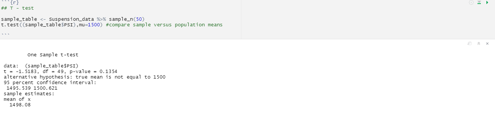
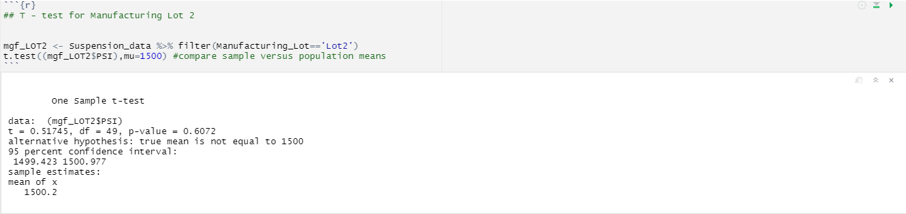

# 15-MechaCar_Statistical_Analysis

## Linear Regression to Predict MPG

Which variables/coefficients provided a non-random amount of variance to the mpg values in the dataset?
Is the slope of the linear model considered to be zero? Why or why not?
Does this linear model predict mpg of MechaCar prototypes effectively? Why or why not?

Linear Model:

## Summary Statistics on Suspension Coils

The design specifications for the MechaCar suspension coils dictate that the variance of the suspension coils must not exceed 100 pounds per square inch. Does the current manufacturing data meet this design specification for all manufacturing lots in total and each lot individually? Why or why not?

Total Summary:

Lot Summary:

## T-Tests on Suspension Coils

summarize your interpretation and findings for the t-test results. Include screenshots of the t-test to support your summary.

T test for the sample in the population:

Box Plots for the three lots:

T test for Lot 1:

T test for Lot 2:

T test for Lot 3:

## Study Design: MechaCar vs Competition

Write a short description of a statistical study that can quantify how the MechaCar performs against the competition. In your study design, think critically about what metrics would be of interest to a consumer: for a few examples, cost, city or highway fuel efficiency, horse power, maintenance cost, or safety rating.
In your description, address the following questions:
What metric or metrics are you going to test?
What is the null hypothesis or alternative hypothesis?
What statistical test would you use to test the hypothesis? And why?
What data is needed to run the statistical test?